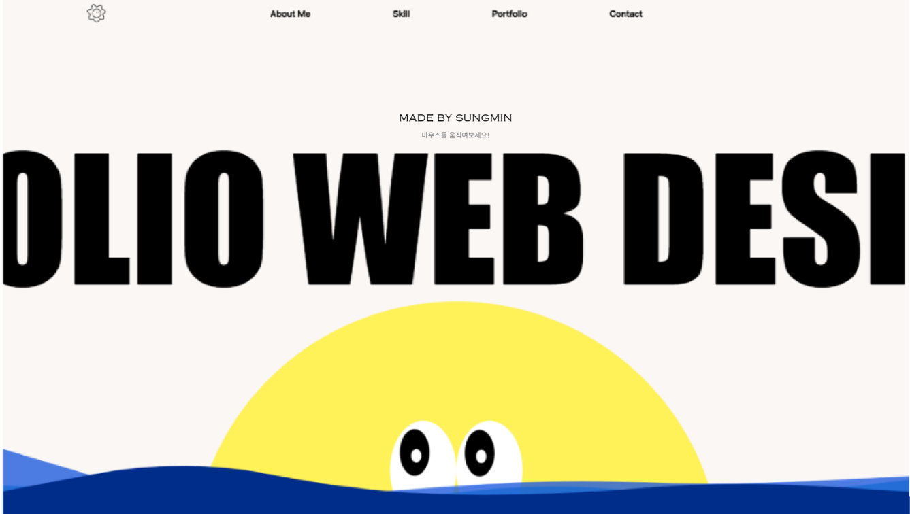
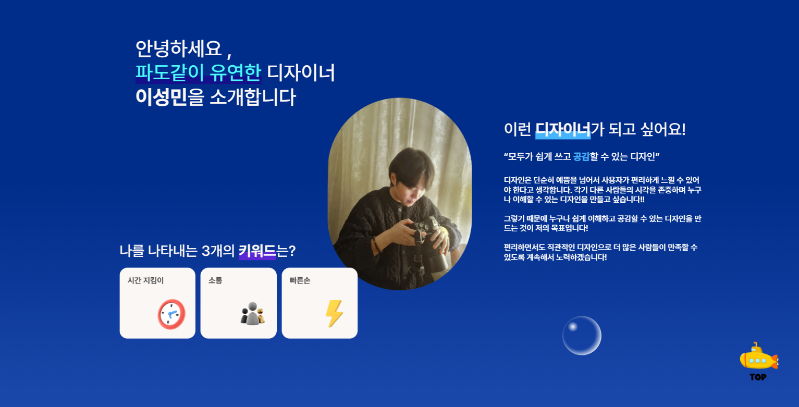
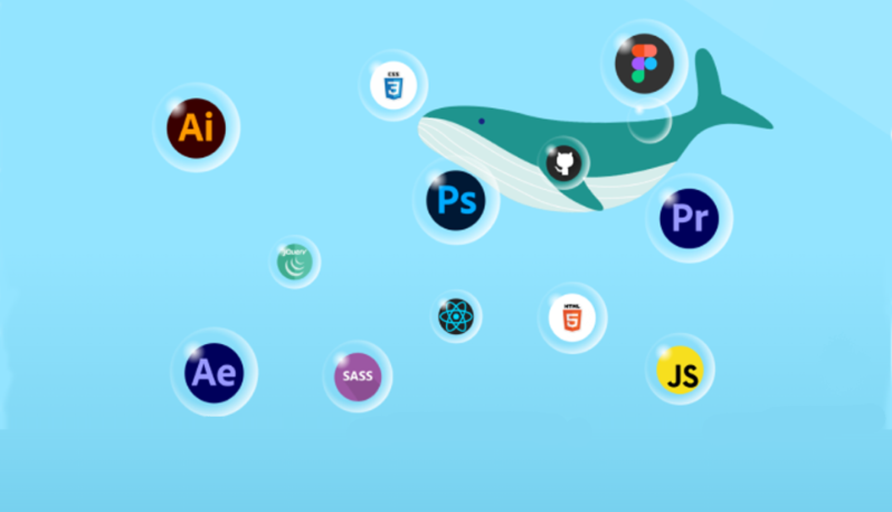
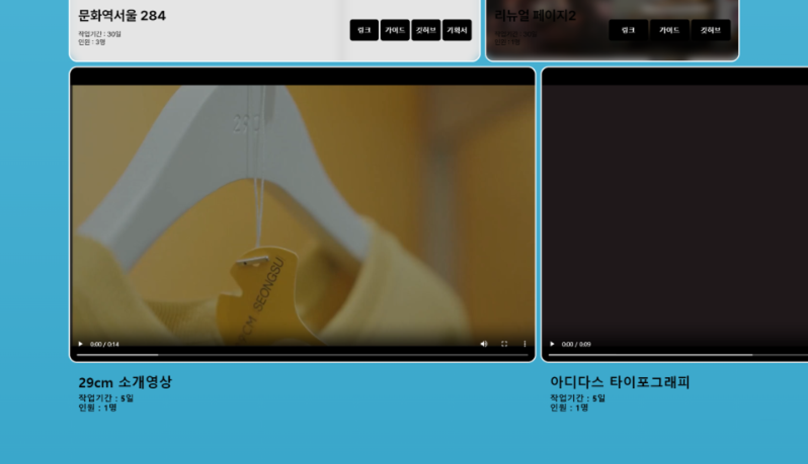
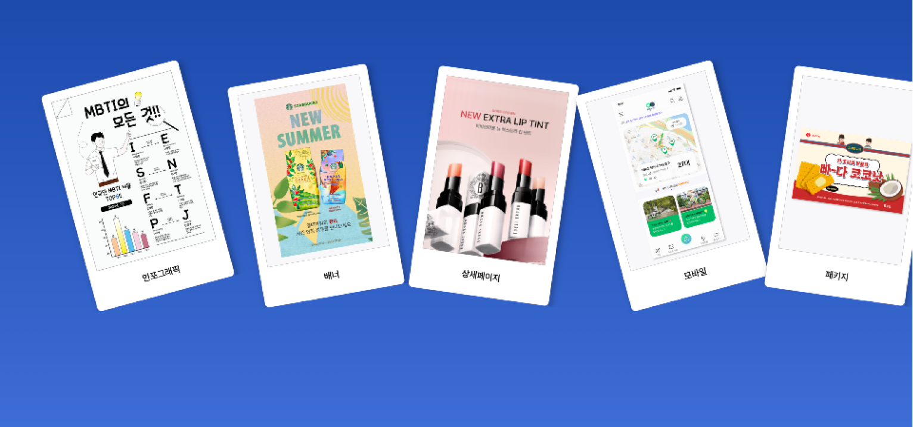

# 🐳 개인 포트폴리오

## 🐬 About
- **제작 기간:** 2024/06/03 ~ 2024/06/30
- **참여 인원:** 1명 (이성민)

## 🐬 디자인 전략

- **일러스트를 활용한 다채로운 디자인**
  - 다양한 일러스트를 사용해 시각적인 재미를 만들고자 했습니다.

- **애니메이션 효과 추가**
  - js 애니메이션을 통해 보는 재미를 풍부하게 하고, 지루하지 않도록 구성했습니다.

- **나를 표현하는 홈페이지**
  - '바다'라는 주제를 통해 저의 개성과 특색을 담아내고자 했습니다.

## 🐬 Concept

- 차분하고 여유로운 여름 바다를 주제로 디자인했습니다. 저의 성격과 닮은 잔잔한 바다 느낌을 살려, 다양한 바다 요소들을 탐험할 수 있도록 구성했습니다. 심해로 들어가는 탐험형 구조로, 방울, 물고기, 잠수함 등의 애니메이션을 추가해 인터랙티브한 요소를 더했습니다. 클릭 시 모달 창이 열려 상세한 내용을 확인할 수 있습니다.

## 🐬 Color

- 메인 컬러로 하늘색, 초록색, 남색 등 파스텔톤 색상을 사용해 부드러운 느낌을 주었습니다. 바다의 청량함을 강조하고, 포인트 컬러로 에메랄드 그린을 선택해 시각적인 다양성을 더했습니다.

## 🐬 페이지의 구성과 동작

### 헤더 애니메이션

- 헤더 부분에 JavaScript로 물결 애니메이션을 추가해 역동적인 느낌을 주었습니다.
- 눈동자가 마우스를 따라가게해 재미를 주었습니다.

### 스크롤 애니메이션

- 스크롤 하면 사진이 같이 밑으로 내려와 지정된 위치로 오게하였습니다.

### 탭 버튼과 모달 창

- 방울 모양의 탭 버튼을 클릭하면 스킬 숙련도 정보를 확인할 수 있는 모달 창이 나타납니다.

### 이동식 슬라이드

- 슬라이드 기능을 통해 영상을 쉽게 감상할 수 있도록 구현했습니다.

### 작업물 모달 창

- 가로스크롤 애니메이션을 적용했습니다.
- 아이콘을 클릭하면, 모달 창이 엘리베이터처럼 아래에서 위로 슬라이드하여 나타납니다.
- 모달 창이 고정된 상태에서 작품을 감상할 수 있으며, 내부 스크롤 기능을 추가해 긴 내용을 편리하게 확인할 수 있도록 했습니다.

